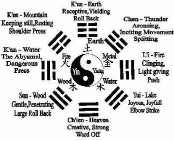
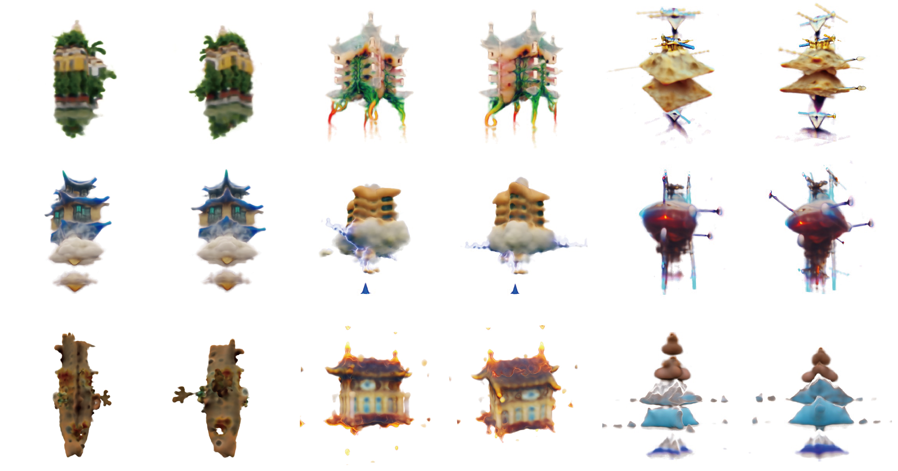
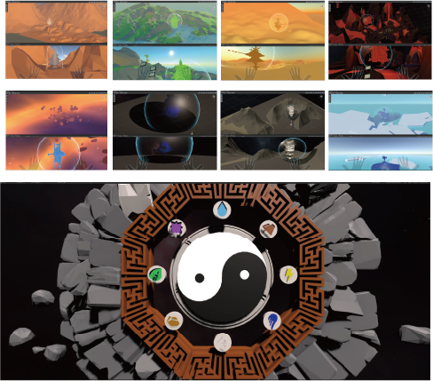

# Advanced-project
## Taoist Eight Trigrams - An experiment in gestural interaction in virtual reality space
### Links
#### video link
https://www.youtube.com/watch?v=iiQl7l3nNGE
#### Github link
https://github.com/swk16/Advanced-project
### Brief
Bagua is an interactive experience, presented as a virtual reality (VR) artwork. The eight trigrams represent a system of yin and yang in which things change themselves, symbolizing various natural phenomena that are combined in parallel to the yin and yang of nature to form eight different forms. The interactive experience is based on the unity game engine and combines oculus meta quest 2 with leap motion gesture control.
The core purpose of this piece is to explore the spiritual core of Taoism in Chinese traditional culture, the eight trigrams, by extracting the eight elements of Heaven, Earth, Wind, Thunder, Water, Fire, Mountain and Lake. This is combined with the Taoism five elements, yin and yang, and presented to participants in a gamified way. The eight trigrams and the properties of the elements they represent create different game scenarios. The concept of the deep connection between things is emphasized, corresponding to the Taoist concept that all things are related to each other and that Yin and Yang harmonize to produce balance. All things and phenomena in the vast universe contain yin and yang, the two sides of the surface and the inside. This is the general law of the material world, in which they are both opposed to each other and dependent on each other. This is the general law of the material world, and it is a law that has always influenced us.
I tried to simulate the identity of a control element in a virtual environment for the player, and then to explore the interactions between the elements by controlling the collision of the trigrams in the Bagua through gestures, to better explain the traditional culture of eight trigrams to the participants.

### Project time

I'll break down my development process into three time periods
#### The direction period
As I proposed at the beginning of the advanced project, I wanted to create a tool to create 3D model format objects through artificial intelligence and machine learning that could be used in unity, unreal and other game engines, but after talking to Charisma.ai, I realized that I didn't have a lot of artificial intelligence and couldn't do it on my own. I am not able to develop this tool independently.
After talking to my supervisor Phoenix and visiting the interactive design studio in Liverpool, it became clear to me that my speciality is human-computer interaction and interactive projects.
#### Inspiration and learning period
I am one of those people who, when completing any of my projects, wants to tap into a part of culture, be it mythology, history, etc., as I did when I chose the 7 Deadly Sins as inspiration for my first semester pcomp coursework.
I was attracted to The Religious System of China: Its Ancient Forms, Evolution, History and Present Aspect by J.J.M. de Groot, which introduces Chinese religion from a Western perspective, and found that Taoist feng shui was becoming widely.So starting with the history of Taoism and choosing the element of Bagua as the main element for the creation.
#### Practice period
After experiencing the last demonstration where some of the group used leap motion for gesture manipulation interaction, this fascinated me and there is probably not a boy who would not be blown away by the spaced out manipulation display in the Iron Man movie. So I chose to use vr glasses with gesture interaction to develop the game experience I wanted in unity.
During the development process I discovered a modified dreamfield3D content generator based on dreamfield-torch, and I also tried to change the input and train it to generate 3-dimensional files in .ply and .obj format to be placed in the game scenes, which fulfilled my initial vision.

### Game Scenes

cci
